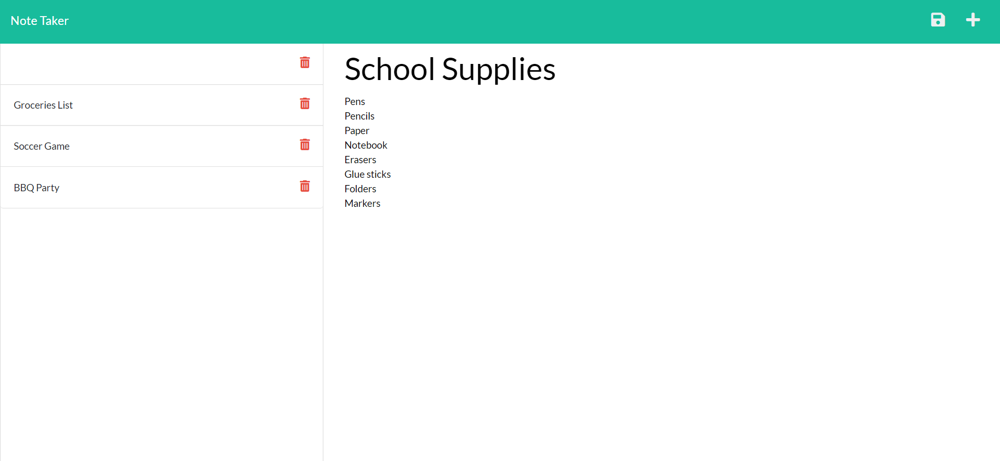

# NoteTaker

## **Project Summary** ⚡️

_This app is for small business owners that want to be able to write and save notes, so they can be more organize and keep tracks of tasks that need to be completed._

__________________________________________________________________________________________________________________________________________________

## **Tools Used** 🛠️

* HTML
* CSS
* JavaScript
* Node Js
* Express 
* Inquiere

___________________________________________________________________________________________________________________________________________________

## **Steps**📋

* When the app is open, you are presented with a landing page with a link to a note page.
* Once clicked to the note page you are presented with exsiting notes listed on the left-hand column and empty fields to enter a new note on the right hand side.
* When entered a new note title and note text, a svae icon appears in the navigation at the top right of the page.
* When Save icon is clicked, the new note that is entered is saved and appears in the left-hand column with the other existing notes
* When you click on an existing note in the list in the left-hand column, then that note appears in the right-hand column
* When the Write icon in the navigation at the top of the page is clicked, then you are presented with empty fields to enter a new note title and the note’s text in the right-hand column.

___________________________________________________________________________________________________________________________________________________

## **Website** 📷

___________________________________________________________________________________________________________________________________________________

# 📷 Video

[Live video Demo](https://youtu.be/WkadxIoMR3I)

___________________________________________________________________________________________________________________________________________________

## **Recourses** 💡

[Katherine Y : Github](https://github.com/katherineyoguez/NoteTaker)

[Live website](https://notetaker13.herokuapp.com/notes)

____________________________________________________________________________________________________________________